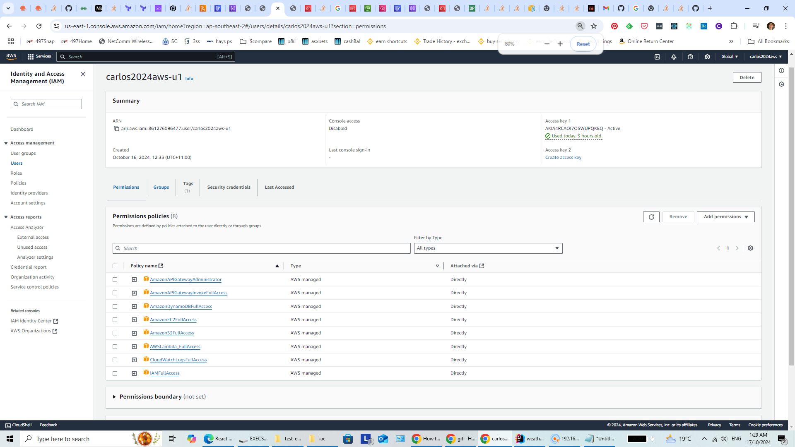

# weather-app
## IAC folder
This folder contains the tf file that creates:
- dynamodb table
- lambda function from a index.mjs zipped
- api gateway http
- related iam 

Please refer to the IAM programmatic user and its permissions required to be able to run this tf file


```
cd iac
terraform apply
```

## UI folder
This ui is written in ReactJS + RTK-Query from Vite template

It is a simple form to accept city name, submit buttons and visual display of the JSON response

```
cd ui
npm run dev
```

## API folder
This was a sandbox using expressjs to consume the openweather api

The lambda function was based on this initially (without dynamodb) and converted into lambda with dynamodb code

Feel free to ignore this

```
cd api
npm run dev
```

## NOTES
The openweather api free account is able to consume the current weather

However the historical weather is giving back 401 (see api/index.ts for an example); hence did not include in the terraform and lambda
